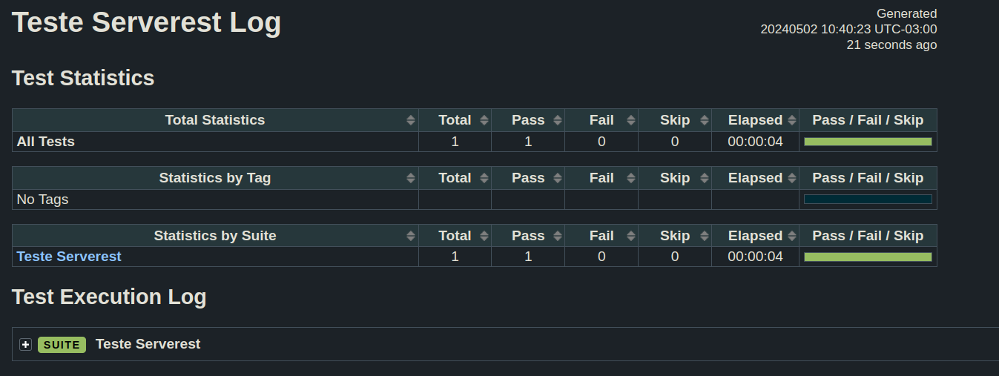

<h1>Projeto de Automação</h1>


## Tecnologias

- Robot
- Python
- VScode
- Git

## Instalar as dependencias

### Baixar python

- Python versão 3.11

### Baixar robotframework

- pip install robotframework

### Instalar as librarys para o projeto

- pip install robotframework-seleniumlibrary


## Librarys utilizadas

- SeleniumLibrary
- String


### Clone o projeto

```jsx
git clone git@github.com:samillycarvalho/serverest-frontend.git
```

### Entre no diretorio

```jsx
cd serverest-frontend
```

### Entre no vscode

dentro do diretorio você da esse comando

```jsx

code .
```

### Executando os testes

robot -d results ./tests/nome-do-teste

ex:

```jsx

 robot -d resuts ./tests/teste_serverest.robot
```

### Resultados

Tests Log
